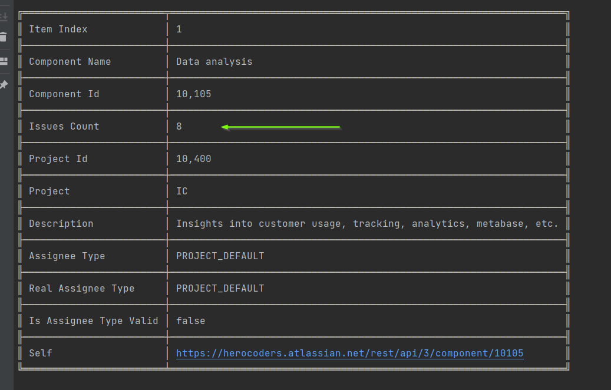

### Jira Task
Create JavaScript code that uses Jira REST API to retrieve data from the Issue Checklist project, and outputs in human-readable form (to the console or a file) a list of components that don't have a "component lead", along with the number of issues from the Issue Checklist project which belongs to the component.

#### Setup
- Node.JS 14 ( or later )
- Install dependencies `yarn` or `npm i`
- `npm start` - Runs project.
- `npm test` - Runs tests.
- `npm run coverage` - Runs code coverage.

#### Assumptions
- ✅ There are some screenshots from my answer in the 'output' folder.
- ✅ We assume the Jira response format is not going to change.
- ✅ I've used 'nock' for mocking the rest API.

#### Todo & If I have more time:
- 💡 Better testing
